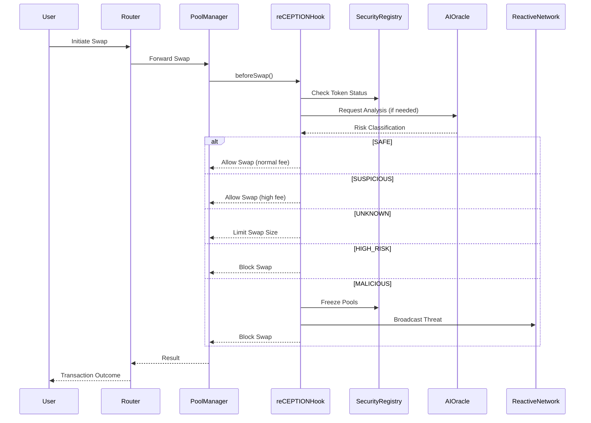
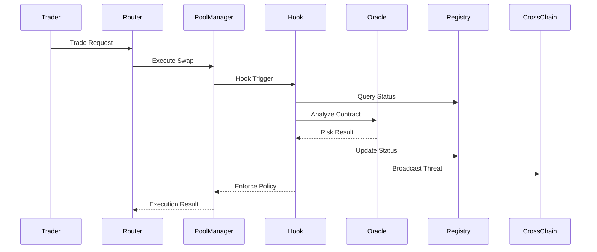
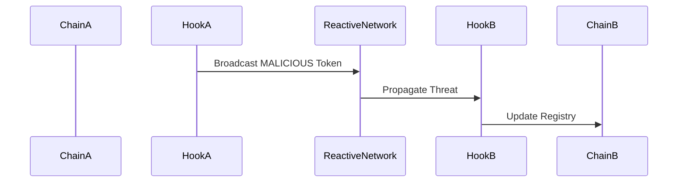

# reCEPTION Hook

### Cross-Chain Security Firewall for Uniswap v4

#### [Website](https://reception.re-labs.io/) | [Pitchdeck](https://drive.google.com/file/d/1EzFJzVdejq8URAUaYuzT9ZngMDU1ovjZ/view?usp=sharing) | [Demo Video]()

## Overview

DeFi has unlocked permissionless finance.
But it also introduced a critical flaw:

**Every contract is treated as trustworthy until it exploits users.**

Malicious tokens, compromised routers, and hidden backdoors can interact with DEX pools without restriction.
By the time risks are identified, **the loss has already occurred**.

reCEPTION changes this.

reCEPTION is a **security-first Uniswap v4 Hook** that embeds protection **directly inside the swap execution path**, transforming DEX infrastructure from passive liquidity into **actively defended systems**.

## The Core Solution

Most security tools **analyze after interaction**.

reCEPTION **intervenes before execution**.

Instead of warning users externally, reCEPTION enforces security **at the protocol level**:

* before swaps happen
* before liquidity is added
* before damage is possible

This is not a dashboard.
This is **execution-layer security**.

## What reCEPTION Does

reCEPTION acts as a **real-time security firewall** for DEX pools.

It continuously evaluates every contract interacting with liquidity pools and dynamically enforces security policies.

### Core Capabilities

* Blocks malicious tokens before swaps execute
* Freezes pools when threats are detected
* Dynamically adjusts fees based on risk
* Limits exposure to unknown contracts
* Detects contract upgrades or tampering
* Shares threat intelligence across chains

## How It Works (Execution Flow)

reCEPTION sits directly inside the **Uniswap v4 Hook lifecycle**, intercepting every critical interaction.

## Architecture

reCEPTION is built as a **layered security system embedded in execution flow**.

## Security Model

Every interacting contract is classified in real time:

| Status     | Meaning                     | Action           |
| ---------- | --------------------------- | ---------------- |
| SAFE       | Verified and trusted        | Normal execution |
| SUSPICIOUS | Potential risk              | Higher fees      |
| UNKNOWN    | Not yet analyzed            | Limited exposure |
| HIGH_RISK  | Dangerous behavior detected | Swap blocked     |
| MALICIOUS  | Confirmed threat            | Pools frozen     |

## Key Mechanisms

### Dynamic Security Fees

Risk directly impacts execution cost.

* Safe → low fee
* Suspicious → higher fee
* Unknown → restricted + high fee
* Malicious → blocked

This introduces **economic deterrence at protocol level**.

### Contract Integrity Protection

Smart contracts can change via proxy upgrades.

reCEPTION prevents this by:

* storing analyzed code hash
* comparing at execution time
* reverting on mismatch

This eliminates **post-audit exploit vectors**.

### Pool Freeze System

When a token is classified as malicious:

* all pools using that token are frozen
* swaps are disabled instantly
* manual or automated review required

This prevents **systemic liquidity attacks**.

### Cross-Chain Threat Intelligence

Threats don’t stay isolated.

reCEPTION ensures they don’t.

If a malicious token is detected on one chain:

→ it is **blocked across all integrated chains**

## Why This Matters

Today’s DeFi security model is reactive:

* audits happen too early
* dashboards act too late
* users bear the risk

reCEPTION introduces a new model:

**Security enforced at execution.**

This transforms DEXs into:

* self-defending systems
* risk-aware liquidity infrastructure
* cross-chain security networks

## Key Benefits

* Protects traders from malicious tokens
* Protects LPs from rug pulls
* Reduces protocol-level attack surface
* Introduces real-time risk pricing
* Automates threat containment
* Enables cross-chain defense

## Vision

reCEPTION is not just a hook.

It is the foundation of a new category:

**Execution-Level Security Infrastructure for Web3**

As DeFi scales, security must:

* be embedded
* be real-time
* be autonomous

reCEPTION is building that layer.
